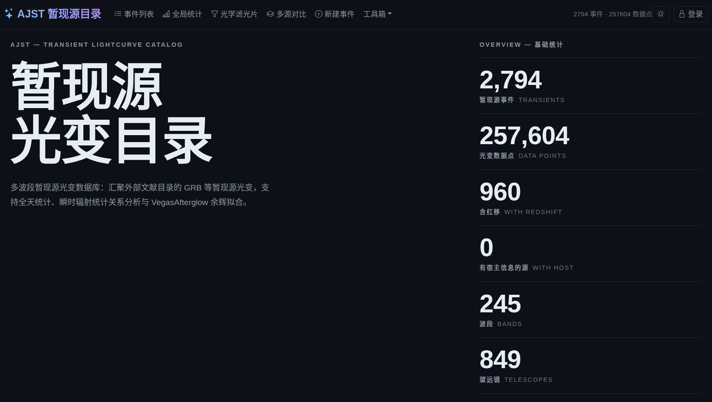

# AJST: A Joint Storage & Toolkit for Transient Astronomy

A lightweight, self-hostable web database for GRB afterglows and other transients.



**Status: active development — not a finished product.** AJST is a personal
project, built and maintained by one person on a personal computer through
vibe coding powered by the [Kimi-K3](https://www.kimi.com/news/kimi-k3) model. Development time and model quota are
limited, so expect rough edges and gradual progress.

AJST was inspired by a number of earlier statistical/catalog works in the
transient community:
- [Dainotti, M. G. et al. An optical gamma-ray burst catalogue with measured redshift – I. Data release of 535 gamma-ray bursts and colour evolution. Monthly Notices of the Royal Astronomical Society 533, 4023–4043 (2024).](https://academic.oup.com/mnras/article/533/4/4023/7697178)
- 

Its core goals:

- **Open** — code (this repo, MIT) and data (the separate
  [AJST-Data](https://github.com/Cooper-J2000/AJST-Data) repo, CC BY 4.0) are
  both public.
- **Lightweight** — a Flask + PostgreSQL backend and a build-free vanilla-JS
  frontend; no Docker, no Node toolchain, no external CDN at runtime.
- **Trustworthy data** — data lives in its own repository with documented
  provenance per source and a stated quality-review plan (see below).
- **Deployable on a personal computer** — clone, `pip install`, point at a
  local PostgreSQL, done.
- **Useful tools included** — see the feature list below.

## Data quality disclaimer — please read

The data is **not** in this repository. It lives in the separate
[AJST-Data](https://github.com/Cooper-J2000/AJST-Data) repository. Importing
it is entirely optional: AJST runs fine with an empty database, and you may
populate it with your own data instead.

The current dataset was batch-collected from publicly available papers and
GCN circulars, and also inherits data from a research project:
- [Dainotti, M. G. et al. An optical gamma-ray burst catalogue with measured redshift – I. Data release of 535 gamma-ray bursts and colour evolution. Monthly Notices of the Royal Astronomical Society 533, 4023–4043 (2024).](https://academic.oup.com/mnras/article/533/4/4023/7697178)
- 

> **The data has NOT yet been manually reviewed entry by entry.** The author
> plans to spend roughly one year auditing the quality of every entry. Until
> then, **do not use this data directly for serious scientific research.**

## Features

Web UI (all local, no build step):

- **Home / overview** — entry point with quick statistics
- **Transient list** — filtering, export, one-click Galactic-extinction
  correction
- **Detail page** — light-curve plotting, data table editing, tags, aliases
- **Compare** — overlay light curves of multiple transients
- **Digitizer** — extract data points from published figure screenshots
  (calibration → manual/color-based point picking → CSV export or direct
  database write). The algorithm is inspired by the MIT-licensed
  `graph-digitizer` project; it is an original reimplementation,
  written as an alternative to the AGPL-licensed WebPlotDigitizer.
- **Filters management** — photometric filter definitions (admin-editable)
- **Afterglow fitting** — submit and monitor
  [VegasAfterglow](https://github.com/YihanWangAstro/VegasAfterglow) MCMC fits
  from the detail page (optional dependency); a preset-combination engine
  (`vegas_unified`) with curated priors, selectable jet structure / circumburst
  medium / host extinction, and joint physical constraints (e.g. FS+RS pair plus
  a standalone FS, two-component jet)
- **Host galaxies** — per-source host coordinates, redshift (spectroscopic or
  photometric) and multi-band photometry (AB/Vega/ST mag systems), plus a
  built-in [pcigale](https://cigale.lam.fr) SED-fitting tab: fixed-z or
  photometric-z runs with selectable bands, results table and best-model SED
  plot, and one-click write-back of the adopted parameters
- **GCN tool** — browse GCN circulars with per-source info cards and
  photometry entry
- **Light-curve upload** — batch CSV import with column mapping
- **Statistical relations** — Amati / Yonetoku / Ghirlanda / lag–luminosity /
  variability–luminosity / Ep–α
- **Statistics** — overview, redshift distribution, band coverage,
  host-galaxy coverage and M*/SFR distributions
- **Admin panel** — user management (`/admin`)

APIs and integrations:

- **STDweb ingest API** — `POST /api/ingest/photometry` (Bearer-token
  authenticated) is designed for seamless connection with the
  STDpipe/STDweb photometry pipeline; an AI agent can assist with the
  deployment and wiring on the STDweb side.
- REST API for transients, light curves, filters, tags, statistics, export,
  extinction, relations, fitting, spectra, GCN, and admin (see
  `docs/TECHNICAL.md`).

## Acknowledgements & third-party credits

- **Galactic extinction** — computed with
  [dustmaps](https://github.com/gregreen/dustmaps) using the **CSFD dust map
  (Liu et al. 2023)** and the **P92 extinction law (Pei 1992, Rv = 3.1)** via
  [dust_extinction](https://github.com/karllark/dust_extinction). Requires a
  one-time `dustmaps.csfd.fetch()` download.
- **Filter definitions** — `filters.json`; the Spitzer/IRAC entries are taken
  from the **SVO Filter Profile Service**; filter transmission curves for the
  host-galaxy SED fits are also retrieved from SVO FPS.
- **Host-galaxy SED fitting** — **pcigale** (Boquien et al. 2019; v2025.1, locally
  installed from source with a numpy-2 `np.trapezoid` patch), run as a subprocess
  with results rendered by `matplotlib`.
- **All-sky map** — embedded **Aladin Lite 3.8.2** (CDS).
- **Afterglow fitting** — **VegasAfterglow** (v2.0.6 tested), with `corner`
  and `matplotlib` for posterior plots.
- **Spectral line markers** — the line lists on the spectra page are taken
  verbatim from the object pages of the **Transient Name Server
  (wis-tns.org)**.
- **Digitizer** — algorithm inspired by the MIT-licensed `graph-digitizer`;
  an original reimplementation as a self-hosted alternative to
  WebPlotDigitizer (AGPL).
- **Frontend vendor libraries** (bundled locally, no CDN): Bootstrap 5.3.3,
  bootstrap-icons 1.11.3, Chart.js 4.4.7 (all MIT).
- **Data sources** — see the per-directory READMEs in
  [AJST-Data](https://github.com/Cooper-J2000/AJST-Data); if you use a subset
  of the data, please cite the original works listed there.

## Roadmap & honest caveats

- A considerable number of features are **not yet developed or integrated**.
- Some existing features are **relatively rough** and may be **removed in
  future versions**.
- For some planned features the author has **not yet formed a mature design**;
  they will be refined step by step.
- AJST is deliberately **lightweight**: it aims to cover the commonly needed
  functionality, but it has an explicit scope boundary and will **not** grow
  without limit.

## Contributing

Community participation is very welcome:

- Open an **issue** for suggestions, bug reports, or data-quality notes.
- Open a **pull request** if you'd like to co-develop.

## Quick start

Requirements: Python ≥ 3.10, PostgreSQL ≥ 14.

```bash
git clone https://github.com/Cooper-J2000/AJST.git
cd AJST

python3 -m venv .venv && source .venv/bin/activate
pip install -r requirements.txt
# optional, only for afterglow fitting:
# pip install "VegasAfterglow[mcmc]" corner matplotlib

# create the database (as a PostgreSQL superuser or with createdb rights)
createdb ajst_catalog

# set the admin password (REQUIRED — otherwise a random one is generated
# at every startup and printed nowhere)
export AJST_CATALOG_PASSWORD='choose-a-strong-password'

# optional: pull the data repository into ./catadata and import it
git clone https://github.com/Cooper-J2000/AJST-Data.git catadata
cd backend && python3 etl.py && cd ..

# run
./backend/start.sh        # listens on 127.0.0.1:5000 (loopback, for reverse proxy;
#                          #  set AJST_HOST=0.0.0.0 to expose directly)
```

Without `catadata/`, the app still starts with an empty database; you can add
your own transients through the UI or the APIs.

### Configuration (environment variables)

| Variable | Default | Purpose |
|---|---|---|
| `DATABASE_URL` | `postgresql+psycopg2:///ajst_catalog` | PostgreSQL DSN |
| `AJST_CATALOG_PASSWORD` | random per startup | initial admin password |
| `AJST_INGEST_TOKEN` | unset (ingest API disabled) | Bearer token for `/api/ingest/*` |
| `AJST_DATA_DIR` | `<repo>/catadata` | data directory location |
| `AJST_PYTHON` | `python3` | interpreter used by `start.sh` |
| `AJST_HOST` | `127.0.0.1` | listen address (loopback for reverse proxy; set `0.0.0.0` to expose directly) |
| `PORT` | `5000` | listen port |

### GCN circulars

The GCN tool runs in **online reverse-proxy mode**: each circular's JSON is
fetched on demand from `https://gcn.nasa.gov/circulars/<id>.json`. The
circular list is paged on demand — only the latest page (100 circulars) plus
the total count is fetched initially, and neighboring pages are pulled when
you navigate past the window edge. No local archive is stored, no caching,
and no manual download is needed.

## Repository layout

```
backend/    Flask app, SQLAlchemy models, ETL, fitting engines, routes
frontend/   build-free SPA (vanilla JS ESM) + bundled vendor libraries
scripts/    maintenance scripts (SVO filter registration, ...)
docs/       TECHNICAL.md — full technical documentation (Chinese)
catadata/   (git-ignored) clone of AJST-Data, or your own data
```

## License

Code: [MIT](LICENSE). Data: CC BY 4.0 in the separate
[AJST-Data](https://github.com/Cooper-J2000/AJST-Data) repository; subsets
under `external/` remain subject to the terms and citation requirements of
their original sources.
