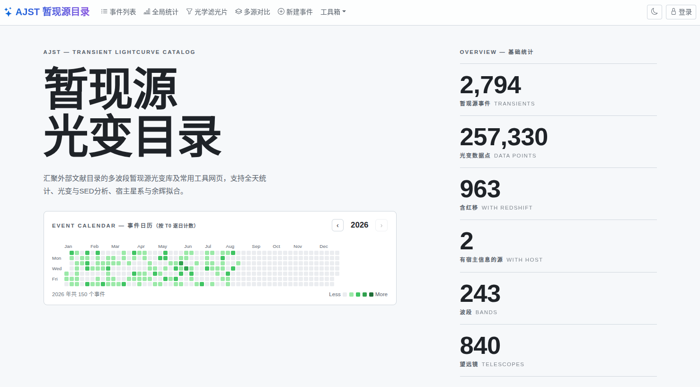
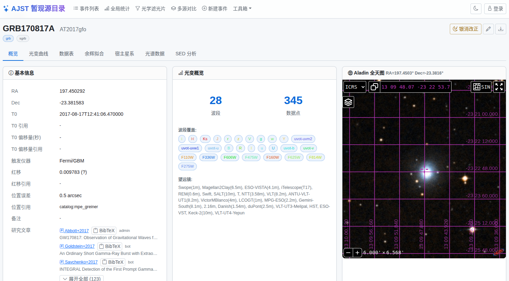
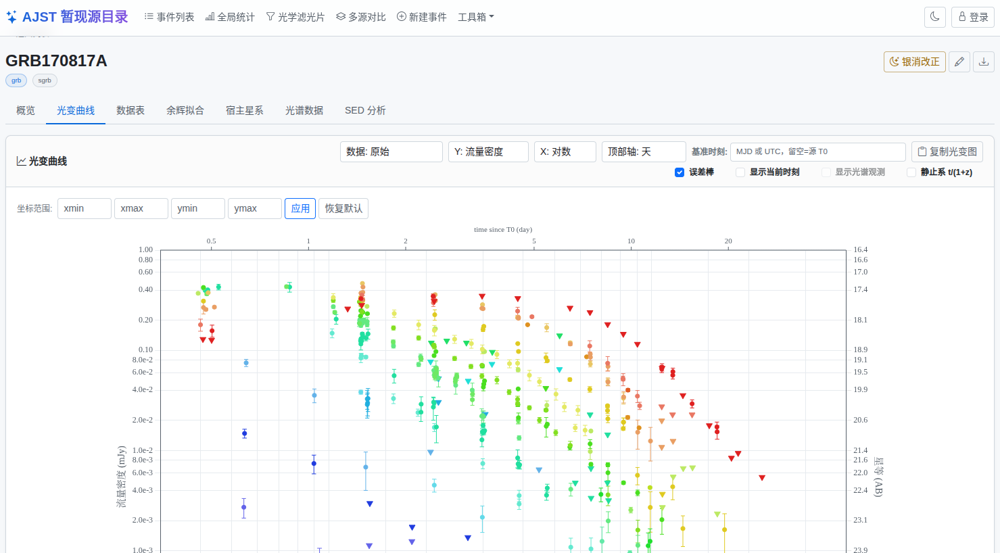
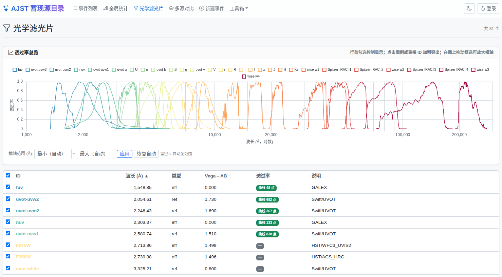

# AJST — A Joint Storage & Toolkit for Transient Astronomy

[](LICENSE)
[](https://github.com/Cooper-J2000/AJST-Data)
[](requirements.txt)
[](https://www.postgresql.org)

AJST is a self-hostable web database and analysis toolkit for GRB afterglows
and other astrophysical transients. It combines a multi-band light-curve
catalog (currently **2,794 events**, **257,330 photometry points**, **963
redshifts**) with Galactic-extinction machinery, afterglow and host-galaxy
SED fitting, prompt-emission scaling relations, and everyday research tools
(figure digitizer, GCN reader, synthetic spectrophotometry). The stack is a
Flask + PostgreSQL backend and a build-free vanilla-JS frontend with all
libraries bundled locally — clone, `pip install`, point at PostgreSQL, run.

<p align="center">
  
</p>

## Features

### Catalog

- **Transient registry** — coordinates (decimal/sexagesimal), T0 with
  reference and offset metadata, redshift (spec-z / photo-z / upper limit),
  trigger instrument, tags, aliases, free-form JSONB extension fields.
- **Unified photometry store** — per-point original value and unit
  (`mag`/`mJy`/`μJy`/`Jy`/`cgs`), magnitude system (AB/Vega), upper-limit and
  host-subtraction flags, telescope/instrument, and reference; times
  normalized to Δt since T0 with MJD as the authoritative observation time.
- **Editing** — two-tier permissions (admin / regular users), inline table
  editing, batch operations, non-destructive "discard" flagging, CSV upload
  with column mapping, per-event literature lists with BibTeX.
- **Reversible file↔database ETL** (`etl.py --sync` / `--dump` / `--prune`)
  against the versioned [AJST-Data](https://github.com/Cooper-J2000/AJST-Data)
  layout (one JSON + one CSV per event).

**Detail page** — basic parameters, literature with one-click BibTeX, Aladin
Lite finder chart, external-catalog parameters (T90, Epeak, Eiso, … from
GBM/BAT/XRT and literature samples), and derived rest-frame quantities:

<p align="center">
  
</p>

**Light-curve plotting** — multi-band plots with error bars, linear/log axes,
flux-density or absolute-magnitude Y axes, observer/rest-frame switching, and
overlay fits of empirical models (power law, broken/smoothly-broken power
law, FRED pulse) with 1σ credible bands from emcee posteriors:

<p align="center">
  
</p>

### Science tools

- **Galactic extinction** — per-point or whole-catalog correction with the
  CSFD dust map ([dustmaps](https://github.com/gregreen/dustmaps)) and the
  Pei (1992) P92 curve (R_V = 3.1,
  [dust_extinction](https://github.com/karllark/dust_extinction)); Vega→AB
  conversion per filter; results cached and re-derived automatically when
  coordinates or filters change.
- **Afterglow fitting** — MCMC fits via
  [VegasAfterglow](https://github.com/YihanWangAstro/VegasAfterglow) with a
  preset engine covering 216 jet-structure × circumburst-medium ×
  host-extinction combinations plus joint constraints (FS+RS pairs,
  two-component jets); corner plots and chains archived per job.
- **Host galaxies** — per-event host coordinates, redshift, and photometry
  (AB/Vega/ST), with a SED-fitting tab running
  [CIGALE/pcigale](https://cigale.lam.fr) (Boquien et al. 2019) or
  [prospector](https://prospect.readthedocs.io) (Johnson et al. 2021);
  fixed-z or photo-z runs with one-click write-back of M*, SFR, age, A_V.
- **Spectra** — upload, overplot, offset, and download spectra; rest-frame
  sub-axis; TNS-style line marking (30 groups with per-group z and expansion
  velocity); optional extinction-corrected secondary products (CSFD + P92).
- **Spectra × filters workbench** — synthetic photometry of library or
  user-uploaded spectra through registered filter curves, with anchoring and
  error budgeting.
- **Statistical relations** — Amati, Yonetoku, Ghirlanda, lag–luminosity,
  variability–luminosity, and Ep–α relations with sample selection, group
  fits, intrinsic scatter, and CSV export.
- **Statistics** — Mollweide sky distribution, redshift histograms, band
  coverage, and host-galaxy M*/SFR populations.

**Filter management** — 81 UV→far-IR filter definitions with transmission
curves (SVO FPS), effective wavelengths, and Vega→AB conversions, feeding the
extinction correction, synthetic photometry, and SED fits:

<p align="center">
  
</p>

### Workflow tools

- **Figure digitizer** — extract points from published figures: axis
  calibration (linear/log), manual and color-based auto picking, CSV export
  or direct database write. An original reimplementation inspired by the
  MIT-licensed `graph-digitizer`, offered as a self-hosted alternative to
  WebPlotDigitizer (AGPL).
- **GCN circular reader** — browse the local GCN archive (45,000+ circulars)
  with per-source info cards, Δt calculator, and a photometry-entry form that
  writes directly into the database.
- **Light-curve template library × K-correction** — versioned templates with
  QC surfaces and error budgets, a template builder wizard, and K-corrected
  prediction curves overlaid on the multi-source comparison page
  (optional ChromaShift engine).
- **Multi-source comparison** — overlay any number of events with per-band
  selection and server-side CSV/JSON export.
- **Pipeline ingest API** — `POST /api/ingest/photometry` (Bearer token) for
  direct wiring to the STDpipe/STDweb photometry pipeline; a full REST API
  covers all entities (see [`docs/TECHNICAL.md`](docs/TECHNICAL.md)).

## Data status

The catalog lives in the separate
[AJST-Data](https://github.com/Cooper-J2000/AJST-Data) repository (CC BY 4.0)
and is optional — AJST runs on an empty database with your own data.

Data were collected from published papers and GCN circulars and inherit part
of the Dainotti et al. (2024, [MNRAS 533, 4023](https://academic.oup.com/mnras/article/533/4/4023/7697178))
sample; every subset documents its provenance and parsing scripts.

> **The catalog has not yet been audited entry by entry.** A systematic
> per-source review is underway, supported by a claim-based queue
> (`audit/state.tsv` + `tools/audit_queue.py`) that lets multiple human or
> LLM-assisted reviewers verify sources in parallel without collisions.
> **Until that review completes, do not use the data directly for serious
> scientific research.** Audit contributions are welcome — see AJST-Data's
> `CONTRIBUTING.md`.

## Quick start

Requires Python ≥ 3.10 and PostgreSQL ≥ 14.

```bash
git clone https://github.com/Cooper-J2000/AJST.git
cd AJST

python3 -m venv .venv && source .venv/bin/activate
pip install -r requirements.txt
# optional: pip install "VegasAfterglow[mcmc]" corner matplotlib   # afterglow fitting
# optional: pip install pcigale                                    # host SED fitting (pcigale engine)

createdb ajst_catalog
export AJST_CATALOG_PASSWORD='choose-a-strong-password'   # REQUIRED

# optional: import the catalog
git clone https://github.com/Cooper-J2000/AJST-Data.git catadata
cd backend && python3 etl.py && cd ..

./backend/start.sh        # listens on 127.0.0.1:27101 (loopback only)
```

| Variable | Default | Purpose |
|---|---|---|
| `DATABASE_URL` | `postgresql+psycopg2:///ajst_catalog` | PostgreSQL DSN |
| `AJST_CATALOG_PASSWORD` | random per startup | initial `admin` password |
| `AJST_INGEST_TOKEN` | unset (disabled) | Bearer token for `/api/ingest/*` |
| `AJST_DATA_DIR` | `<repo>/catadata` | data directory |
| `SPS_HOME` | unset | FSPS data directory (prospector engine) |
| `AJST_HOST` | `127.0.0.1` | listen address (non-loopback refused) |
| `PORT` | `27101` | listen port |

The layered test suite (847 unit, API-contract, and acceptance cases; 843 passed
+ 4 skipped as of 2026-10-03) runs with `python3 -m pytest tests/`.

## Acknowledgements

AJST builds on open tools and catalogs: [dustmaps](https://github.com/gregreen/dustmaps)
(CSFD map, Liu et al. 2023) and [dust_extinction](https://github.com/karllark/dust_extinction)
(Pei 1992); [VegasAfterglow](https://github.com/YihanWangAstro/VegasAfterglow);
[CIGALE/pcigale](https://cigale.lam.fr) (Boquien et al. 2019, A&A 622, A103);
[prospector](https://prospect.readthedocs.io) (Johnson et al. 2021, ApJS 254, 22)
with python-FSPS; the SVO Filter Profile Service; Aladin Lite v3 (CDS);
the Transient Name Server (spectral-line lists); Bootstrap, Chart.js, and
bootstrap-icons (bundled, MIT); and the GCN archive (NASA), HEASARC/MAST
catalogs (BATSE, Fermi GBM/LAT, Swift BAT/XRT/UVOT, Konus-Wind, AGILE-MCAL),
the GRBSN webtool, and literature samples (Dainotti et al. 2024; Wang et al.
2022; Minaev & Pozanenko 2020; Guidorzi et al. 2025; Liang et al. 2023;
Chandra & Frail 2012). Per-directory READMEs in AJST-Data list the exact
provenance and citation requirements for each data subset.

## Contributing & license

Issues and pull requests are welcome (see
[`docs/COMMIT-CONVENTION.md`](docs/COMMIT-CONVENTION.md)); for data auditing,
start from AJST-Data's `CONTRIBUTING.md`. Code is released under the
[MIT License](LICENSE); the data under CC BY 4.0, with `external/` subsets
subject to their original sources' terms and citation requirements.
